# Technical Overview — License Payment System

> This document is the authoritative reference for the system's architecture, data flow, concurrency model, and design decisions. For setup and quick-start instructions see [README.md](./README.md).

---

## Table of Contents

1. [System Context](#1-system-context)
2. [Solution Architecture](#2-solution-architecture)
3. [Project Layer Map](#3-project-layer-map)
4. [Domain Model](#4-domain-model)
5. [CQRS & MediatR](#5-cqrs--mediatr)
6. [Monthly Payment Saga — Full Flow](#6-monthly-payment-saga--full-flow)
7. [External Bank Callback Flow](#7-external-bank-callback-flow)
8. [Concurrency Model](#8-concurrency-model)
9. [Transactional Outbox Pattern](#9-transactional-outbox-pattern)
10. [Observability Pipeline](#10-observability-pipeline)
11. [Security Model](#11-security-model) — JWT · HMAC Webhook · Provider Lock · Rate Limiting · CORS · Idempotency
12. [Database Schema](#12-database-schema)
13. [Infrastructure Stack](#13-infrastructure-stack)
14. [Design Decisions](#14-design-decisions)
15. [Frontend Behavior](#15-frontend-behavior)

---

## 1. System Context

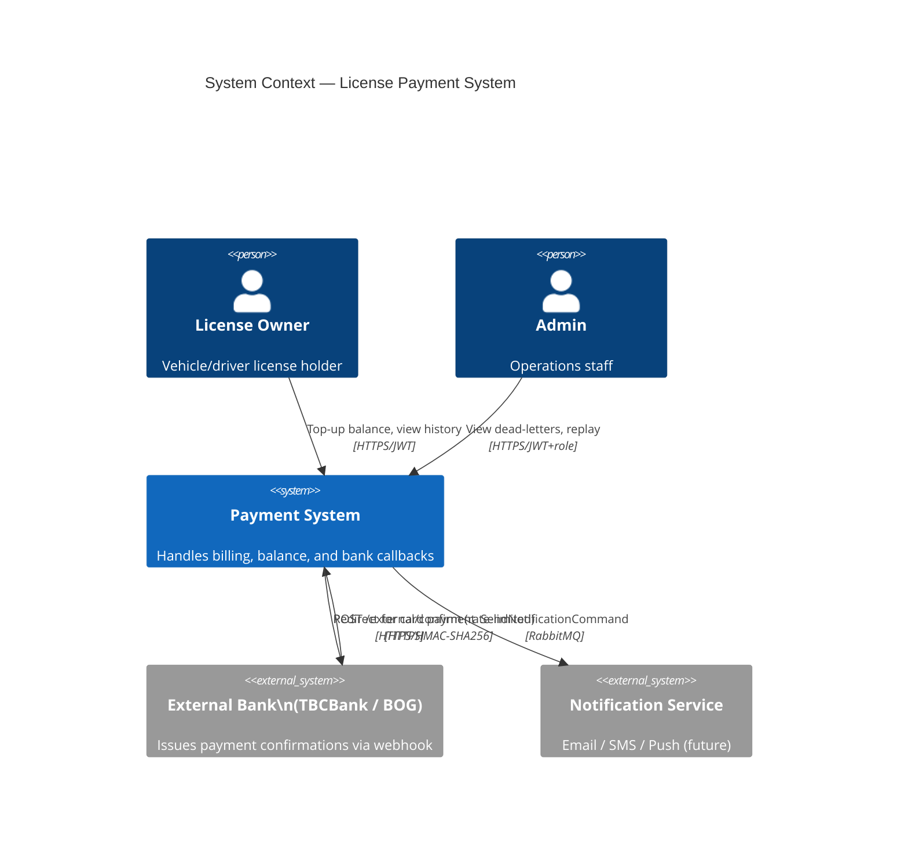

---

## 2. Solution Architecture

The system is split into two microservices that communicate exclusively through RabbitMQ events — no direct HTTP calls between services.

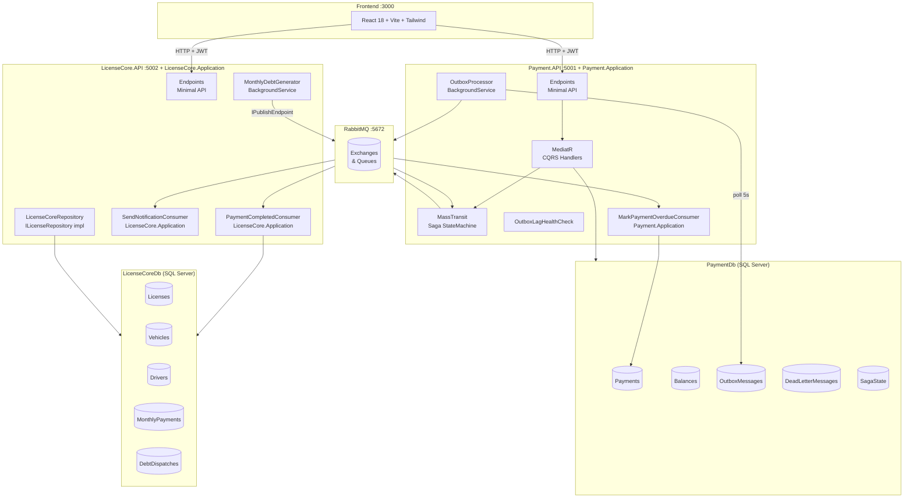

---

## 3. Project Layer Map

```
PaymentSystem.sln
│
├── Shared.Contracts          ← Pure records: events + commands shared between services
│   ├── Events/               ← MonthlyDebtCreatedEvent, BalanceDebitedEvent, …
│   └── Commands/             ← TryDebitBalanceCommand, SendNotificationCommand,
│                                MarkPaymentOverdueCommand
│
├── Payment.Domain            ← Entities, enums — zero framework dependencies
│   ├── Entities/             ← Payment, Balance, OutboxMessage, DeadLetterMessage
│   │                            (IdempotencyKey removed — stored in Redis)
│   └── Enums/                ← PaymentStatus, PaymentType
│
├── Payment.Application       ← Use-cases, abstractions — depends only on Domain + Shared
│   ├── Commands/             ← CQRS command + handler pairs (MediatR)
│   ├── Queries/              ← CQRS query + handler pairs (MediatR)
│   ├── Sagas/                ← MonthlyPaymentSaga (MassTransit StateMachine)
│   ├── Consumers/            ← TryDebitBalanceConsumer, MarkPaymentOverdueConsumer
│   └── Interfaces/           ← IBalanceRepository (TryDebitResult enum co-located),
│                                IPaymentRepository (MarkOverdueAsync added),
│                                IIdempotencyStore (+ IdempotencySlot record)
│
├── Payment.Infrastructure    ← EF Core, repositories, outbox, MassTransit config, Redis
│   ├── Idempotency/          ← RedisIdempotencyStore (SET NX, 24-hour TTL)
│   ├── Data/                 ← PaymentDbContext (NoTracking default)
│   │   └── Migrations/       ← AddPerformanceIndexes, RemoveIdempotencyKeysTable
│   ├── Repositories/         ← BalanceRepository, PaymentRepository (pure raw SQL)
│   ├── Outbox/               ← OutboxProcessor (lease-based), OutboxWriter
│   └── MassTransit/          ← MassTransitConfiguration
│
├── Payment.API               ← ASP.NET Core host — port 5001
│   ├── Endpoints/            ← Balance, Payment, ExternalCallback (rate-limited), Admin
│   └── HealthChecks/         ← MassTransitBusHealthCheck,
│                                OutboxLagHealthCheck (Redis-cached, Degraded@5min / Unhealthy@30min)
│
├── LicenseCore.Application   ← Use-cases, abstractions for LicenseCore — no host deps
│   ├── Consumers/            ← PaymentCompletedConsumer, SendNotificationConsumer
│   │                            (+ SendNotificationConsumerDefinition)
│   └── Interfaces/           ← INotificationService, ILicenseRepository,
│                                IDistributedLockFactory
│
├── LicenseCore.API           ← ASP.NET Core host — port 5002
│   ├── Data/                 ← LicenseCoreDbContext, LicenseCoreRepository
│   ├── Endpoints/            ← License, Vehicle, Driver
│   ├── Entities/             ← License, Vehicle, Driver, LicenseMonthlyPayment,
│   │                            MonthlyDebtDispatch
│   ├── HealthChecks/         ← MassTransitBusHealthCheck
│   └── Services/             ← MonthlyDebtGeneratorService (Redis lock + per-license try-catch,
│                                LogCritical, OTEL dispatch-failure metric),
│                                LoggingNotificationService,
│                                RedisDistributedLockFactory
│
├── Payment.Tests             ← xUnit + Testcontainers integration tests
│   ├── ConcurrentBalanceDebitTests.cs
│   ├── DuplicateExternalConfirmTests.cs
│   └── Infrastructure/SqlServerFixture.cs
│
└── Web/                      ← React 18 + Vite + TypeScript frontend
```

**Dependency rule**: arrows only point inward. Neither `Application` project references `Infrastructure` or host projects. `LicenseCore.Application` follows the same rule as `Payment.Application`.

### Project Reference Graph

**Payment side**

```
Shared.Contracts          (no project refs)
Payment.Domain            (no project refs)
Payment.Application       → Payment.Domain, Shared.Contracts
Payment.Infrastructure    → Payment.Application, Payment.Domain
Payment.API               → Payment.Application, Payment.Infrastructure
Payment.Tests             → Payment.Infrastructure, Payment.API
```

**LicenseCore side**

```
LicenseCore.Application   → Shared.Contracts
                            → LicenseCore.API  ← pragmatic compromise (see note below)
LicenseCore.API           → LicenseCore.Application, Shared.Contracts
```

> **Note — no `LicenseCore.Domain` yet.** Entities (`License`, `Vehicle`, `Driver`,
> `LicenseMonthlyPayment`, `MonthlyDebtDispatch`) currently live in
> `LicenseCore.API/Entities/`. `LicenseCore.Application` references the host project
> solely to access these entities. This is a **temporary pragmatic compromise** until
> entity count justifies a dedicated `LicenseCore.Domain` class library.
> Tracked as a TODO in `LicenseCore.Application.csproj`.

**Critical rules (never violate)**

- `LicenseCore.Application` must **never** reference `Payment.Application` or `Payment.Infrastructure`
- `LicenseCore.API` must **never** be referenced by anything outside its own solution graph
- All cross-service communication goes through RabbitMQ (`Shared.Contracts` events/commands) — never direct project or HTTP references between the two service stacks

---

## 4. Domain Model

```mermaid
erDiagram
    PAYMENT {
        guid Id PK
        guid LicenseId
        decimal Amount
        string Status "Pending|Paid|Overdue|Cancelled|Failed"
        string Type "Monthly|AddVehicle|AddDriver|LicenseSell|LicenceCancel"
        string ExternalPaymentId "nullable — written atomically at confirm time"
        string ProviderId "nullable — written atomically at confirm time"
        string LockedProviderId "nullable — set at redirect time, prevents wrong-provider confirm"
        guid TargetId "nullable — driver or vehicle"
        datetime Month "nullable — for Monthly type"
        datetime CreatedAt
        datetime PaidAt "nullable"
    }

    BALANCE {
        guid AccountId PK
        decimal Amount "CHECK >= 0"
        datetime UpdatedAt
    }

    OUTBOX_MESSAGE {
        guid Id PK
        string Type
        string Payload "JSON, max 64 KB"
        datetime CreatedAt
        datetime ProcessedAt "nullable"
        string Error "nullable"
        int RetryCount
        datetime LockedUntil "nullable — lease expiry"
        string LockedBy "nullable — processor instance id"
    }

    DEAD_LETTER_MESSAGE {
        guid Id PK
        guid OriginalOutboxMessageId
        string Type
        string Payload
        string LastError
        int RetryCount
        datetime DeadLetteredAt
        string Status "Pending|Replaying|Succeeded|Failed"
        guid ReplayedOutboxMessageId "nullable"
        datetime ReplayedAt "nullable"
        string ReplayError "nullable"
    }

    REDIS_IDEMPOTENCY_KEY {
        string Key "PaymentSystem:{endpoint}:{clientKey}"
        string Value "JSON: {StatusCode, Payload, CreatedAt}"
        duration TTL "24 hours — auto-expired by Redis"
    }

    MONTHLY_PAYMENT_STATE {
        guid CorrelationId PK
        string CurrentState
        guid LicenseId
        decimal Amount
        datetime Month
        string FailureReason "nullable"
        guid PaymentTimeoutTokenId "nullable"
        datetime CreatedAt
        datetime TimeoutAt "nullable — 30-day grace expiry"
    }
```

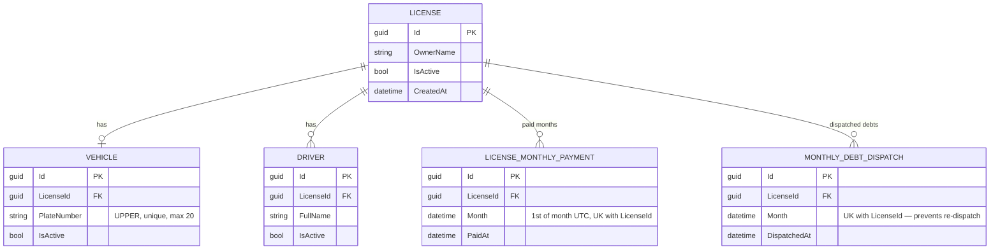

---

## 5. CQRS & MediatR

All writes from the HTTP layer go through a MediatR command. Reads go through queries. No endpoint touches a repository directly.

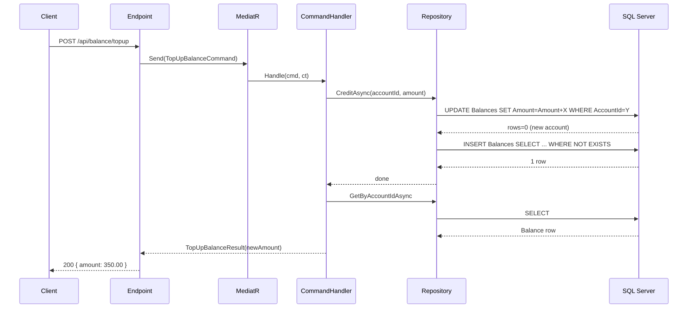

### Command Inventory

| Command                         | Handler                                | Key mechanism                                            |
| ------------------------------- | -------------------------------------- | -------------------------------------------------------- |
| `TopUpBalanceCommand`           | `TopUpBalanceCommandHandler`           | UPDATE-then-INSERT loop; SQL 2627/2601 retry             |
| `PayViaBalanceCommand`          | `PayViaBalanceCommandHandler`          | `ProcessBalancePaymentAsync` — single atomic transaction |
| `ConfirmExternalPaymentCommand` | `ConfirmExternalPaymentCommandHandler` | `TryConfirmExternalAtomicallyAsync` — filters by `Id + LockedProviderId`; writes `ExternalPaymentId` atomically |
| `CreatePaymentCommand`          | `CreatePaymentCommandHandler`          | Raw SQL INSERT + idempotency key                         |

### Query Inventory

| Query                              | Result                                              |
| ---------------------------------- | --------------------------------------------------- |
| `GetBalanceQuery`                  | `{ accountId, amount }`                             |
| `GetPaymentsQuery(page, pageSize)` | `{ payments[], page, pageSize, total, totalPages }` |

---

## 6. Monthly Payment Saga — Full Flow

The `MonthlyPaymentSaga` is a **MassTransit StateMachine** persisted in SQL Server with `ConcurrencyMode.Pessimistic`. It orchestrates the entire monthly billing cycle.

### States

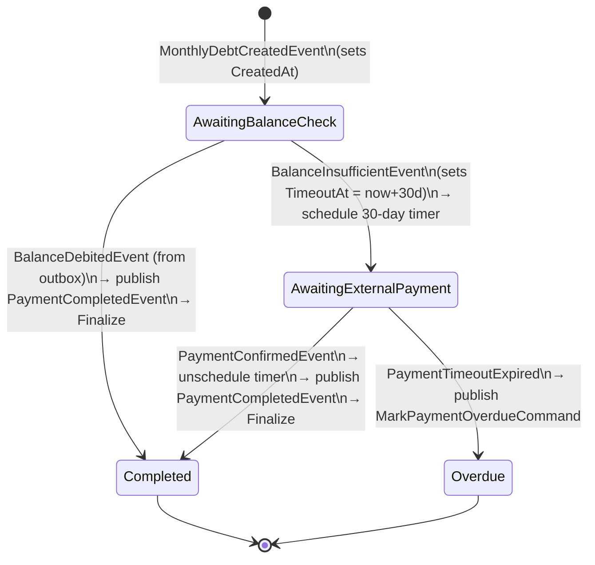

### Happy Path — Balance Available

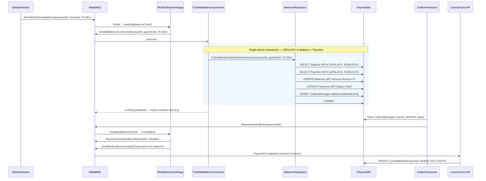

### Insufficient Balance Path — External Payment

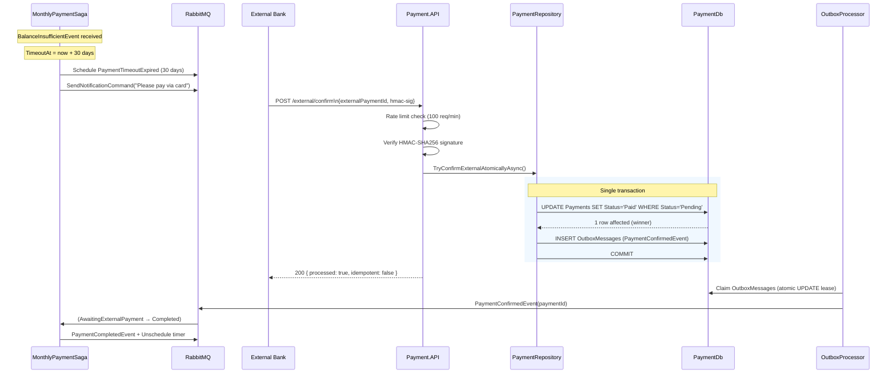

### Overdue Path — Timeout Fires

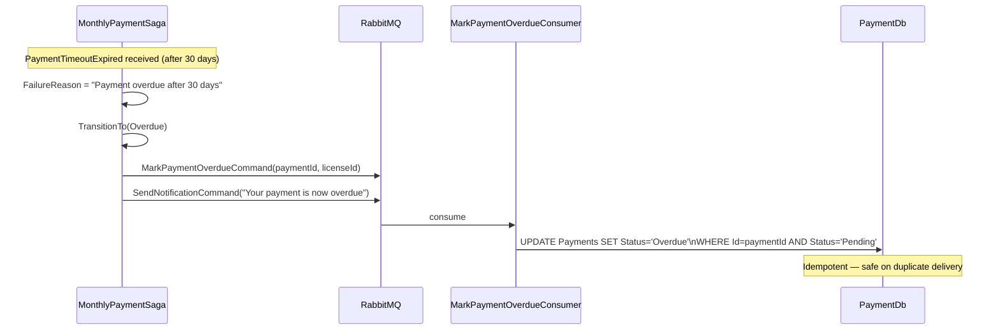

---

## 7. External Bank Callback Flow

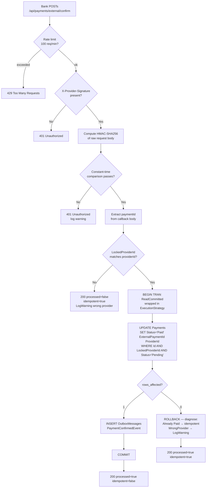

---

## 8. Concurrency Model

### Atomic Saga Debit — `TryDebitAndCompletePaymentAsync`

The saga debit path locks **both** the Balance row and the Payment row inside one transaction, then writes the outbox entry before committing. This prevents three distinct races at once:

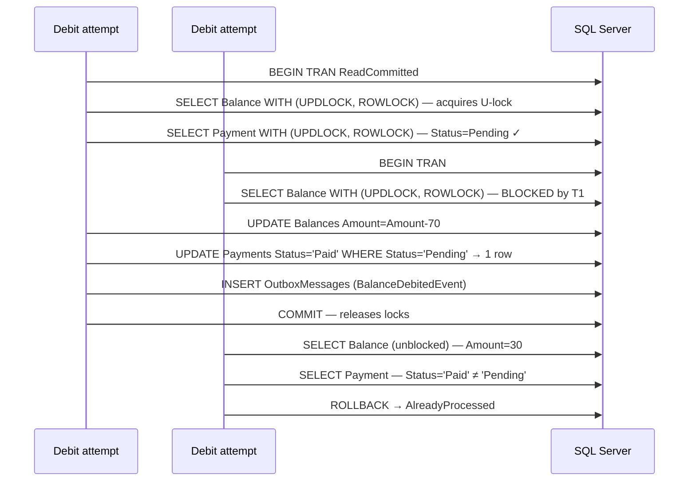

### Double-Debit Prevention (`ProcessBalancePaymentAsync`)

The manual-balance debit path uses the same `UPDLOCK` + `ROWLOCK` pattern:

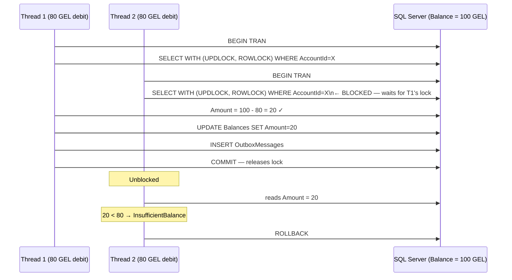

**Why not optimistic concurrency?** Under high concurrency (50+ simultaneous debits), optimistic retries create exponential storm — threads fail, retry, fail again. `UPDLOCK` linearises writes without retries. The `CHECK (Amount >= 0)` constraint is the final guard.

### Duplicate External Confirm

The UPDATE now filters by `Id` and `LockedProviderId` rather than `ExternalPaymentId`. `ExternalPaymentId` starts `NULL` and is written atomically in the same UPDATE that marks the payment `Paid`. `LockedProviderId` is set at redirect time — only the provider the user was redirected to can confirm the payment. A different provider getting `rows_affected = 0` receives `200 idempotent` and a `LogWarning` is emitted.

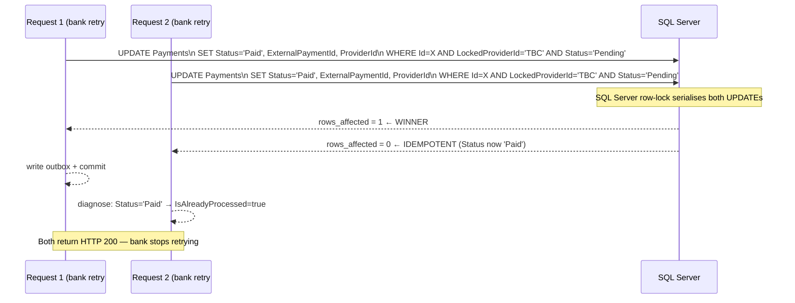

### Saga Pessimistic Locking

```
ConcurrencyMode.Pessimistic on EntityFrameworkRepository
→ SQL Server row-level lock on MonthlyPaymentStates
→ Two messages for the same CorrelationId process strictly sequentially
→ No DbUpdateConcurrencyException, no out-of-order state transitions
```

### Duplicate Saga Prevention — Filtered Unique Index

```
IX_MonthlyPaymentStates_LicenseId_Month  UNIQUE
  WHERE [CurrentState] NOT IN ('Completed', 'Overdue')

→ Two MonthlyDebtCreatedEvent messages for the same (LicenseId, Month)
  cannot both create active saga instances
→ Terminal states are excluded so historical records are preserved
→ TryDebitBalanceConsumer catches unique-constraint violations
  (SQL 2627 / 2601) and acks — no endless retry loop
```

### CreditAsync — Race-Safe Without MERGE

```
1. UPDATE Balances SET Amount=Amount+X WHERE AccountId=Y
2. If @@ROWCOUNT = 0 (new account):
     INSERT Balances SELECT Y, X, now WHERE NOT EXISTS (...)
3. If INSERT raises 2627/2601 (concurrent INSERT won the race):
     retry from step 1 (max 3 attempts)

No MERGE anywhere — MERGE holds a range lock that can deadlock
under concurrent INSERT + UPDATE from separate connections.
```

---

## 9. Transactional Outbox Pattern

The system uses a **custom domain outbox** in `Payment.API` and **MassTransit's built-in EF outbox** in `LicenseCore.API`.

### Why Two Outboxes?

- `ConfirmExternalPaymentCommandHandler` and `TryDebitAndCompletePaymentAsync` are not MassTransit consumers. They use raw `ExecuteSqlRawAsync` which bypasses EF's change tracker — MassTransit's `UseBusOutbox()` cannot intercept these publishes. The custom outbox solves this by writing to the same transaction.
- `MonthlyDebtGeneratorService` uses scoped `IPublishEndpoint` — MassTransit's EF outbox captures these correctly at the consumer level.

### Custom Outbox (Payment.API)

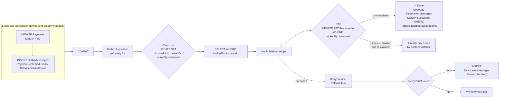

### Dead-Letter Replay Lifecycle

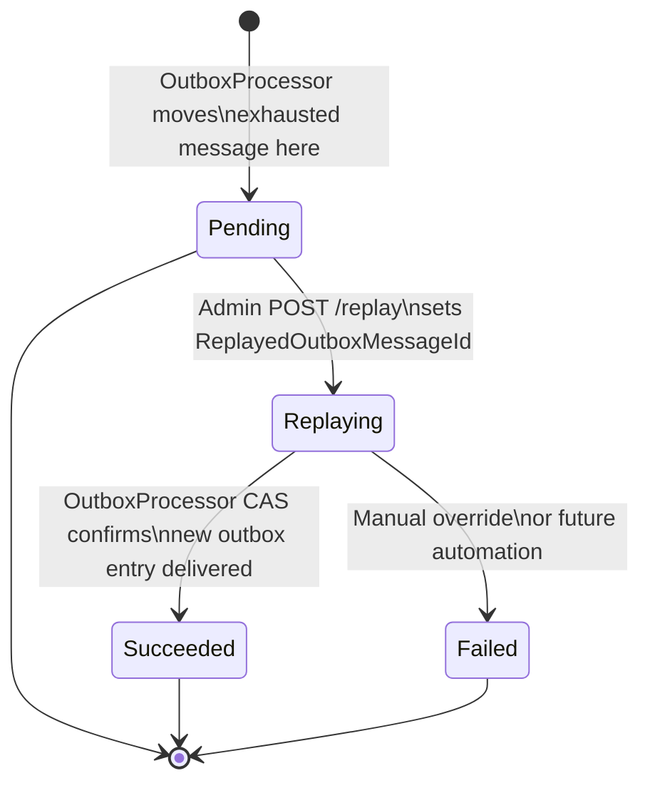

### Lease-Based Claiming (Horizontal Scale Safety)

```
Instance A claims rows 1–20:  UPDATE TOP 20 SET LockedUntil=T+30s, LockedBy='pod-A'
Instance B claims rows 21–40: UPDATE TOP 20 SET LockedUntil=T+30s, LockedBy='pod-B'

If pod-A crashes after Publish but before ProcessedAt update:
  → LockedUntil expires after 30s
  → pod-B (or new pod-A) re-claims the expired rows
  → Consumer receives duplicate → idempotency guard absorbs it
```

### IdempotencyKey TTL

```
Keys are stored in Redis (not SQL Server) with a 24-hour TTL set atomically at creation.
→ Redis expires keys automatically at the storage layer — no cleanup service needed.
→ No background service, no scheduled DELETE, no index for range scans.
→ See Section 11 (IdempotencyKey Storage) for key format and sentinel semantics.
```

---

## 10. Observability Pipeline

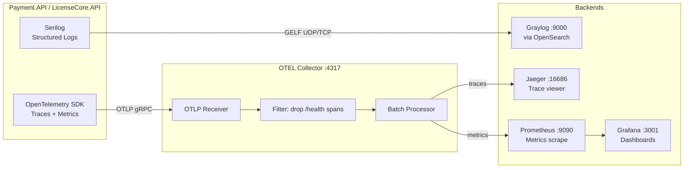

### What Is Instrumented

| Signal      | What is captured                                                                                                                                                                             |
| ----------- | -------------------------------------------------------------------------------------------------------------------------------------------------------------------------------------------- |
| **Logs**    | Correlation ID on every entry · PII fields redacted · request/response at `Information` · errors at `Error` · per-license monthly dispatch failures at `Critical` with `LicenseId` + `Month` |
| **Traces**  | Every HTTP request span · outbound `HttpClient` spans · correlation ID propagated as baggage                                                                                                 |
| **Metrics** | Request duration · request count · error rate · `monthly_debt_dispatch_failures` counter (tags: `licenseId`, `month`) exported via `Meter("LicenseCore.API")` registered with OTEL           |

### Environment Configuration

```
Development:  SampleSuccessRate=1.0, SamplingRatio=1.0, Graylog=off, OTLP=off
Production:   SampleSuccessRate=0.05, SamplingRatio=0.1, Graylog=on (TCP), OTLP=on
```

---

## 11. Security Model

### JWT Validation

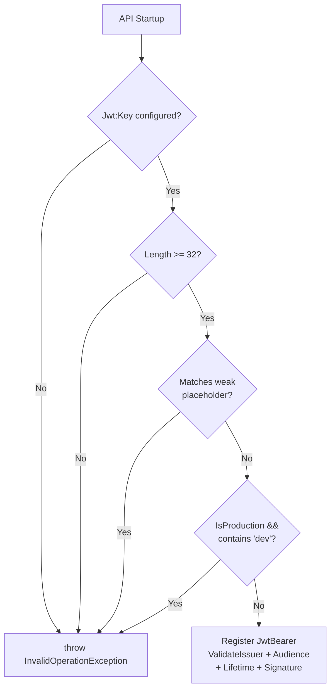

### Webhook HMAC Verification

```
Provider computes: HMAC-SHA256(raw_body, shared_secret)
Provider sends:    X-Provider-Signature: sha256=<hex>

API verifies:
  1. Header present → else 401
  2. Prefix is "sha256=" → else 401
  3. CryptographicOperations.FixedTimeEquals(computed, provided) → else 401
     └─ Constant-time: prevents timing oracle attacks
```

### Provider Lock — LockedProviderId

```
POST /api/payments/{paymentId}/redirect sets LockedProviderId atomically:
  UPDATE Payments
  SET    LockedProviderId = @providerId
  WHERE  Id = @paymentId AND Status = 'Pending' AND LockedProviderId IS NULL

Result:
  Locked            → first redirect; proceed to generate redirect URL
  AlreadyLockedSame → idempotent retry to same provider; proceed
  AlreadyLockedOther → 409 Conflict { error: "payment_locked_to_other_provider" }

POST /api/payments/external/confirm enforces the lock:
  UPDATE ... WHERE Id = @paymentId AND LockedProviderId = @providerId AND Status = 'Pending'
  rows_affected = 0 and LockedProviderId ≠ providerId
    → 200 { processed:false, idempotent:true } + LogWarning (malicious or misconfigured)

Invariant: ExternalPaymentId starts NULL and is written in the same UPDATE
that marks the payment Paid — it is never a prerequisite for confirmation.
```

### Rate Limiting — External Callback

```
Fixed-window limiter on POST /api/payments/external/confirm:
  PermitLimit = 100 requests
  Window      = 1 minute
  QueueLimit  = 0 (reject immediately when exceeded)
  Response    = 429 Too Many Requests

Rationale: the endpoint is public (signed but unauthenticated at the network level).
Without a rate limit, a compromised provider key could flood the queue with
fake callbacks, exhausting connection pool and causing legitimate payment delays.
```

### CORS in Production

```csharp
// Startup throws if any origin lacks https://
policy.WithOrigins(origins)                     // from AllowedOrigins config
      .WithMethods("GET", "POST")               // not AllowAnyMethod
      .WithHeaders("Authorization", "Content-Type",
                   "Idempotency-Key", "X-Correlation-Id")
      .DisallowCredentials()
```

### IdempotencyKey Storage (Redis)

Keys are stored in Redis as JSON blobs under the `PaymentSystem:` instance prefix with a 24-hour TTL set at creation. Redis `SET NX PX` (set if not exists, with expiry in milliseconds) is the native atomic claim operation — equivalent to `INSERT WHERE NOT EXISTS` but without requiring a database transaction or a cleanup background service. The three-state sentinel (`0` / `-1` / `≥100`) maps directly to a field in the serialized JSON value. Abandoned slots (`StatusCode=0` older than 30 s) are detected on the next retry and deleted via `DEL` before re-claiming. Redis TTL handles expiry of legitimately completed slots without any scheduled job.

**503 fallback**: if a `RedisException` is thrown during `TryClaimAsync`, the endpoint returns `503 Service Unavailable`. The request is not forwarded to the command handler — a silent Redis failure must not bypass the idempotency guard and allow double-spend.

### Idempotency-Key Pattern — Claim-Before-Execute

The critical invariant: the key slot is **claimed before the command executes**. `StatusCode = 0` is a "Processing" sentinel, `StatusCode = -1` is a "Failed" sentinel written when the command throws, and all real HTTP codes are ≥ 100. This prevents two concurrent first-time requests from both executing the command, and ensures crashed slots don't block the client forever.

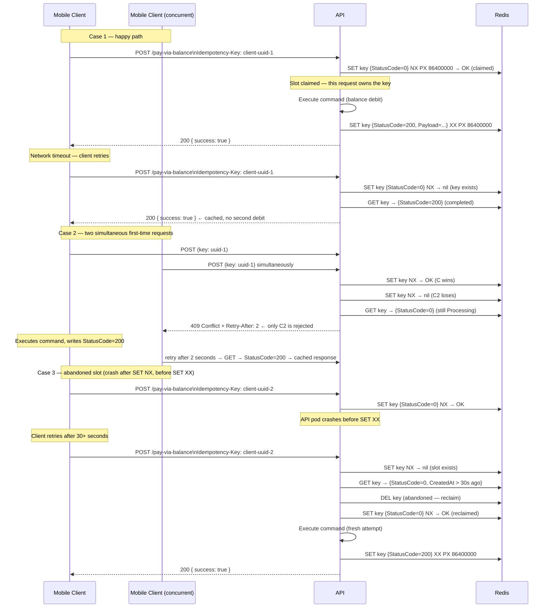

### Notification Fault Isolation

```
SendNotificationConsumerDefinition configures:
  → UseMessageRetry: Exponential(10, 5s → 10min)
  → DiscardFaultedMessages(): after all retries exhausted,
    message is silently dropped rather than sent to the global error queue

Rationale: notification delivery failures (email/SMS outage) must not
accumulate in the error queue and mask genuine payment processing failures.
```

---

## 12. Database Schema

### PaymentDb

```
┌─────────────────────────────────────────────────────────────────┐
│ Payments                                                         │
│  Id               uniqueidentifier   PK                          │
│  LicenseId        uniqueidentifier   NOT NULL                    │
│  Amount           decimal(18,4)      NOT NULL                    │
│  Status           nvarchar           'Pending'|'Paid'|'Overdue'  │
│                                      'Cancelled'|'Failed'        │
│  Type             nvarchar           'Monthly'|'AddVehicle'|…    │
│  ExternalPaymentId nvarchar(450)     NULLABLE — written at       │
│                                      confirm time, not before    │
│  ProviderId       nvarchar(450)      NULLABLE — written at       │
│                                      confirm time, not before    │
│  LockedProviderId nvarchar(50)       NULLABLE — set at redirect  │
│                                      time, guards confirm        │
│  TargetId         uniqueidentifier   NULLABLE                    │
│  Month            datetime2          NULLABLE                    │
│  CreatedAt        datetime2          NOT NULL                    │
│  PaidAt           datetime2          NULLABLE                    │
│                                                                  │
│  IX_Payments_ExternalPaymentId_ProviderId  UNIQUE                │
│    WHERE ExternalPaymentId IS NOT NULL                           │
└─────────────────────────────────────────────────────────────────┘

> `LockedProviderId` is set atomically at redirect time using
> `UPDATE WHERE LockedProviderId IS NULL`. Only one provider can
> ever hold the lock. `TryConfirmExternalAtomicallyAsync` filters
> by both `Id` and `LockedProviderId`, so a different provider's
> callback gets `rows_affected = 0` regardless of `Status`.

┌─────────────────────────────────────────────────────────────────┐
│ Balances                                                         │
│  AccountId   uniqueidentifier   PK                              │
│  Amount      decimal(18,4)      NOT NULL                        │
│  UpdatedAt   datetime2          NOT NULL                        │
│                                                                  │
│  CONSTRAINT CHK_Balance_NonNegative CHECK (Amount >= 0)         │
└─────────────────────────────────────────────────────────────────┘

┌─────────────────────────────────────────────────────────────────┐
│ OutboxMessages                                                   │
│  Id          uniqueidentifier   PK                              │
│  Type        nvarchar(256)      NOT NULL                        │
│  Payload     nvarchar(max)      NOT NULL  JSON, ≤ 64 KB         │
│  CreatedAt   datetime2          NOT NULL                        │
│  ProcessedAt datetime2          NULLABLE                        │
│  Error       nvarchar(max)      NULLABLE                        │
│  RetryCount  int                NOT NULL  DEFAULT 0             │
│  LockedUntil datetime2          NULLABLE  lease expiry          │
│  LockedBy    nvarchar(200)      NULLABLE  instance id           │
│                                                                  │
│  IX_OutboxMessages_Unprocessed  (CreatedAt ASC)                 │
│    WHERE ProcessedAt IS NULL AND RetryCount < 5                 │
│    Prevents full scan as millions of processed rows accumulate  │
└─────────────────────────────────────────────────────────────────┘

┌─────────────────────────────────────────────────────────────────┐
│ DeadLetterMessages                                              │
│  Id                      PK                                     │
│  OriginalOutboxMessageId uniqueidentifier                       │
│  Type, Payload, LastError, RetryCount                           │
│  OriginalCreatedAt, DeadLetteredAt                              │
│  Status                  nvarchar  'Pending'|'Replaying'|       │
│                                    'Succeeded'|'Failed'         │
│  ReplayedOutboxMessageId uniqueidentifier  NULLABLE             │
│  ReplayedAt              datetime2          NULLABLE            │
│  ReplayError             nvarchar           NULLABLE            │
│                                                                  │
│  IX_DeadLetterMessages_DeadLetteredAt                           │
│  IX_DeadLetterMessages_ReplayedOutboxMessageId                  │
└─────────────────────────────────────────────────────────────────┘

> **IdempotencyKeys are stored in Redis — not in SQL Server.**
> See Section 11 (IdempotencyKey Storage) for the Redis key format, TTL, and
> three-state sentinel semantics. The SQL `IdempotencyKeys` table was dropped
> in migration `RemoveIdempotencyKeysTable`.

┌─────────────────────────────────────────────────────────────────┐
│ MonthlyPaymentStates  (Saga)                                     │
│  CorrelationId   uniqueidentifier   PK                          │
│  CurrentState    nvarchar                                       │
│  LicenseId       uniqueidentifier                               │
│  Amount          decimal(18,4)                                  │
│  Month           datetime2                                      │
│  FailureReason   nvarchar           NULLABLE                    │
│  PaymentTimeout  uniqueidentifier   NULLABLE  MassTransit token │
│  CreatedAt       datetime2                                      │
│  TimeoutAt       datetime2          NULLABLE  queryable expiry  │
│                                                                  │
│  IX_MonthlyPaymentStates_CurrentState                           │
│  IX_MonthlyPaymentStates_TimeoutAt                              │
│  IX_MonthlyPaymentStates_LicenseId_Month  UNIQUE                │
│    WHERE [CurrentState] <> 'Completed'                          │
│      AND [CurrentState] <> 'Overdue'                            │
└─────────────────────────────────────────────────────────────────┘

-- MassTransit EF Outbox tables (separate from custom OutboxMessages)
InboxState  /  OutboxMessage  /  OutboxState
```

### LicenseCoreDb

```
┌─────────────────────────────────────────────────────────────────┐
│ Licenses                                                        │
│  Id           PK  │  OwnerName  │  IsActive  │  CreatedAt      │
└─────────────────────────────────────────────────────────────────┘

┌─────────────────────────────────────────────────────────────────┐
│ Vehicles                                                        │
│  Id  PK  │  LicenseId FK (1:1)  │  PlateNumber  │  IsActive    │
│                                                                  │
│  IX_Vehicles_PlateNumber  UNIQUE  (max 20 chars, ^[A-Z0-9-]+$) │
└─────────────────────────────────────────────────────────────────┘

┌─────────────────────────────────────────────────────────────────┐
│ Drivers                                                         │
│  Id  PK  │  LicenseId FK (1:N)  │  FullName  │  IsActive       │
└─────────────────────────────────────────────────────────────────┘

┌─────────────────────────────────────────────────────────────────┐
│ LicenseMonthlyPayments                                          │
│  Id  PK  │  LicenseId FK  │  Month (1st of month UTC)          │
│  IX_LicenseMonthlyPayments_LicenseId_Month  UNIQUE             │
└─────────────────────────────────────────────────────────────────┘

┌─────────────────────────────────────────────────────────────────┐
│ MonthlyDebtDispatches                                           │
│  Id  PK  │  LicenseId FK  │  Month  │  DispatchedAt            │
│  IX_MonthlyDebtDispatches_LicenseId_Month  UNIQUE              │
└─────────────────────────────────────────────────────────────────┘
```

---

## 13. Infrastructure Stack

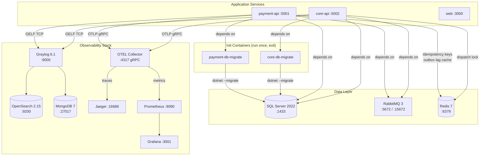

All services have Docker healthchecks. APIs wait for `service_healthy` on SQL Server, RabbitMQ, and Redis, and `service_completed_successfully` on the migration init containers.

| Service         | Port         | Image                                      | Role                                                     |
| --------------- | ------------ | ------------------------------------------ | -------------------------------------------------------- |
| SQL Server 2022 | 1433         | mcr.microsoft.com/mssql/server:2022-latest | Primary data store                                       |
| RabbitMQ 3      | 5672 / 15672 | rabbitmq:3-management                      | Message broker                                           |
| Redis 7         | 6379         | redis:7-alpine                             | Idempotency keys (24 h TTL), dispatch lock, health cache |
| OTEL Collector  | 4317 gRPC    | otel/opentelemetry-collector-contrib       | Telemetry pipeline                                       |
| Jaeger          | 16686        | jaegertracing/all-in-one:1.58              | Distributed tracing UI                                   |
| Prometheus      | 9090         | prom/prometheus:v2.53.0                    | Metrics scrape + storage                                 |
| Grafana         | 3001         | grafana/grafana:11.1.0                     | Dashboards                                               |
| Graylog 6.1     | 9000         | graylog/graylog:6.1                        | Structured log aggregation                               |

SQL Server connections in both services are configured with:

- `EnableRetryOnFailure(maxRetryCount: 5, maxRetryDelay: 30s)` — automatic transient fault retry
- `CommandTimeout(30)` — prevents connection pool starvation on slow queries
- All `BeginTransactionAsync` calls wrapped in `CreateExecutionStrategy().ExecuteAsync(...)` — retry-safe manual transactions

---

## 14. Design Decisions

### `TryDebitAndCompletePaymentAsync` — single atomic transaction for the saga path

**Problem**: The original saga flow had the balance debit, payment status update, and event publication as three separate operations. A crash between any two left the system in an inconsistent state: balance debited but payment still Pending, or payment Paid but no event published.

**Decision**: Collapse all three into one `ReadCommitted` transaction with `UPDLOCK` on both rows: read-and-lock Balance, read-and-lock Payment (check it's still `Pending`), debit balance, mark payment `Paid`, insert `BalanceDebitedEvent` into the custom outbox — all in one commit. The consumer publishes nothing on success; `OutboxProcessor` delivers the event. If the payment is already `Paid` when the lock read completes, return `AlreadyProcessed` and ack.

---

### UPDLOCK instead of optimistic concurrency

**Problem**: Optimistic concurrency catches conflicts after the fact with a `DbUpdateConcurrencyException`. Under high load (50+ concurrent debit requests for popular accounts), every retry collides with another thread's commit, causing exponential retry storms.

**Decision**: `UPDLOCK ROWLOCK` serialises reads at the SQL row level. The second transaction holds a U-lock (which can co-exist with S-locks) until it needs to write, at which point it upgrades to X-lock. The first transaction holds the X-lock until commit, then the second reads the updated balance. No retries, no exceptions, linear throughput.

---

### UPDATE-then-INSERT instead of MERGE for balance top-up

**Problem**: `MERGE WITH (HOLDLOCK)` acquires a range lock even when the target row already exists. Under concurrent top-ups for the same account (e.g., bulk batch crediting), multiple MERGE statements deadlock on each other's range locks, causing transaction rollbacks and noisy error logs.

**Decision**: Try `UPDATE` first; if `@@ROWCOUNT = 0` the row doesn't exist yet so `INSERT WHERE NOT EXISTS`. If that INSERT raises SQL 2627/2601 (concurrent INSERT won the race), retry the `UPDATE` — which will now succeed. Maximum 3 attempts; final fallback is a plain `UPDATE`. This is deadlock-free because UPDATE acquires a point lock (not range), and the NOT EXISTS guard serialises inserts.

---

### `UPDATE WHERE Status='Pending'` for external confirms

**Problem**: Bank systems retry failed HTTP calls. A network timeout between the payment being processed and the HTTP 200 response causes the bank to resend the same confirmation.

**Decision**: SQL's `UPDATE WHERE ExternalPaymentId=X AND Status='Pending'` is a **compare-and-swap** at the engine level. Two simultaneous calls issue identical UPDATEs. SQL Server's row-level locking guarantees exactly one gets `rows_affected=1`. The loser returns `IsAlreadyProcessed=true`. Both respond HTTP 200. The bank sees success and stops retrying.

---

### Two outbox mechanisms coexisting

**Problem**: MassTransit's `UseBusOutbox()` only intercepts messages published within a MassTransit consumer context. Both `ConfirmExternalPaymentCommandHandler` (MediatR) and `TryDebitAndCompletePaymentAsync` (repository) execute raw `ExecuteSqlRawAsync` — MassTransit cannot intercept these publishes.

**Decision**: Write the outbox entry in the same raw SQL transaction as the state change (`PaymentRepository`, `BalanceRepository`), then use a custom `OutboxProcessor` background service to dispatch. MassTransit's EF outbox remains active for consumer-side publishes in both services. The two mechanisms use different tables (`OutboxMessages` vs MassTransit's `OutboxMessage`) and never conflict.

---

### Lease-based outbox claiming over `READPAST`

**Problem**: `READPAST` skips locked rows at SELECT time, but the lock is released immediately after the read — before the message is published. Two processor instances can claim the same row if the first instance's read completes before it publishes.

**Decision**: Atomic `UPDATE … SET LockedUntil=+30s, LockedBy=instanceId WHERE LockedUntil IS NULL OR LockedUntil < now` claims rows atomically. Only rows claimed by the current `instanceId` are processed. After publish, a CAS `UPDATE SET ProcessedAt WHERE LockedBy=instanceId` acts as a final guard. Expired leases allow re-claim after 30 seconds, handling pod crashes.

---

### `DeadLetterStatus` enum over boolean `IsReplayed`

**Problem**: A boolean `IsReplayed` cannot distinguish between "replay submitted but not yet confirmed" and "replay confirmed successful". An admin who triggers a second replay while the first outbox entry is still processing would inject a duplicate.

**Decision**: Replace with a 4-state enum: `Pending → Replaying → Succeeded | Failed`. The replay endpoint sets `Replaying` and records the new outbox message ID atomically. It returns `409 Conflict` if the current status is already `Replaying`. `OutboxProcessor` sets `Succeeded` via a targeted `UPDATE WHERE ReplayedOutboxMessageId = @id AND Status = 'Replaying'` when the CAS on `ProcessedAt` confirms delivery. No duplicate replay possible.

---

### Overdue payments via Payments table, not saga state

**Problem**: The original `GET /api/payments/overdue` queried `MonthlyPaymentStates` directly to find sagas whose `TimeoutAt` had passed. This tightly coupled an HTTP endpoint to the saga persistence table, which is an implementation detail of MassTransit's saga engine.

**Decision**: When the saga's `PaymentTimeoutExpired` fires, it publishes a `MarkPaymentOverdueCommand`. `MarkPaymentOverdueConsumer` executes `UPDATE Payments SET Status='Overdue' WHERE Id=X AND Status='Pending'` — idempotent and saga-agnostic. The endpoint queries `Payments.Where(p => p.Status == Overdue)` — a plain domain query with no MassTransit coupling. The saga table's `TimeoutAt` column is retained for diagnostic visibility only.

---

### `QueryTrackingBehavior.NoTracking` as default

**Problem**: EF Core caches entities in the change tracker per scope. If a `Balance` entity is loaded earlier in the same request pipeline (e.g. from `GetByAccountIdAsync`), a subsequent `FromSqlRaw` with `UPDLOCK` returns the **cached stale snapshot** from the change tracker — not the freshly locked row from the database. The subsequent `SaveChangesAsync` then issues a second conflicting UPDATE.

**Decision**: Set `NoTracking` as the DbContext default. Every UPDLOCK read explicitly uses `.AsNoTracking()`. All writes use `ExecuteSqlRawAsync` inside the locked transaction — never `SaveChangesAsync`. This eliminates the entire class of stale-cache update bugs.

---

### Idempotency-Key — Redis SET NX over SQL INSERT WHERE NOT EXISTS

**Problem**: The original SQL `IdempotencyKeys` table required a background cleanup service (`IdempotencyKeyCleanupService`, hourly), a dedicated index (`IX_IdempotencyKeys_CreatedAt`), and a write transaction per endpoint call. A secondary problem: if the API pod crashes after the `INSERT` but before the `UPDATE`, the slot stays at `StatusCode = 0` permanently, locking the client out with repeated 409s for 24 hours.

**Decision**: Moved to Redis. Three-state sentinel model:

- `StatusCode = 0` — Processing: INSERT was issued, command is in-flight (or slot was abandoned by a crash).
- `StatusCode = -1` — Failed: command threw an unhandled exception; error payload stored for the client.
- `StatusCode ≥ 100` — Completed: real HTTP result cached, return immediately.

Redis `SET NX PX` (set-if-not-exists with millisecond expiry) atomically claims the slot — returns `true` only if the key did not exist. On claim failure, `GET` the existing value:

- `StatusCode = -1` → return `500` with the stored error payload; client must use a new key.
- `StatusCode ≥ 100` (and within 24 h TTL) → return cached response.
- `StatusCode = 0` and `CreatedAt > now − 30 s` → slot is actively in-flight, return `409 Conflict`.
- `StatusCode = 0` and `CreatedAt ≤ now − 30 s` → slot was abandoned; `DEL` it, re-`SET NX` to reclaim, then execute fresh.

Command execution is wrapped in try/catch: on any unhandled exception the slot is updated to `StatusCode = -1` with the error message JSON (via `SET XX PX` — update only if key exists), then re-thrown. Redis TTL handles 24-hour expiry automatically — no `IdempotencyKeyCleanupService` or `IX_IdempotencyKeys_CreatedAt` index needed. The SQL `IdempotencyKeys` table was dropped in migration `RemoveIdempotencyKeysTable`.

---

### Redis for tactical caching and coordination

**Problem**: Three components independently solved coordination and caching problems against SQL Server: the idempotency table required a cleanup service + dedicated index + per-request write transaction; `sp_getapplock` held an open SQL connection for the entire multi-minute dispatch run; and `OutboxLagHealthCheck` used per-pod `SemaphoreSlim` caches that couldn't share results across replicas.

**Decision**: Add Redis 7 (single node, append-only persistence) for exactly these three concerns. Scope is strictly bounded:

| Concern               | Redis usage                                           | What was replaced                             |
| --------------------- | ----------------------------------------------------- | --------------------------------------------- |
| Idempotency keys      | `SET NX PX` + `SET XX PX` — 24 h TTL per key          | SQL `IdempotencyKeys` table + cleanup service |
| Monthly dispatch lock | `SET NX PX` + Lua renewal heartbeat                   | `sp_getapplock` SQL transaction               |
| Health check cache    | `IDistributedCache` `GetStringAsync`/`SetStringAsync` | Per-pod `SemaphoreSlim` double-checked lock   |

Redis is **not** used for: outbox messages (must be in the same SQL transaction as the payment update), balance/payment row locking (`UPDLOCK` is superior when data lives in SQL), saga state (MassTransit manages this in SQL Server with pessimistic locking), or session state (JWT is stateless).

**Failure modes**:

- **Idempotency path**: `RedisException` during `TryClaimAsync` → `503 Service Unavailable`. The request is rejected rather than forwarding to the command handler — a silent Redis failure must not bypass the guard and allow double-spend.
- **Dispatch lock path**: Redis unavailable → lock acquisition fails gracefully; dispatch proceeds without the lock (log `Warning`). The per-license `INSERT WHERE NOT EXISTS` guards still prevent double-billing.
- **Health cache path**: Redis unavailable → fall through to live SQL `COUNT(*)` query; no error surfaced to the caller.

---

### `LicenseCore.Application` — same layering discipline as `Payment.Application`

**Problem**: `LicenseCore.API` originally contained `PaymentCompletedConsumer`, `SendNotificationConsumer`, and `INotificationService` directly in the host project. Business logic (consumer handlers, service interfaces) in a host project cannot be unit tested without the ASP.NET host; it violates the dependency-inversion principle and makes the consumers invisible to teams working on the application layer.

**Decision**: Introduce a `LicenseCore.Application` class library (no `Sdk.Web`, no ASP.NET references) containing `Consumers/`, `Interfaces/INotificationService`, and `Interfaces/ILicenseRepository`. `LicenseCore.API` provides concrete implementations (`LicenseCoreRepository`, `LoggingNotificationService`) and registers them in DI. `MonthlyDebtGeneratorService` stays in the host (it is host-lifecycle infrastructure, not business logic). This mirrors the `Payment.Application` / `Payment.Infrastructure` split exactly.

---

### `OutboxLagHealthCheck` — Degraded before Unhealthy with Redis shared 30-second cache

**Problem**: If `OutboxProcessor` stalls (RabbitMQ connection drops, memory pressure), outbox messages accumulate silently. No health endpoint reported the backlog, so the pod would continue to receive traffic and appear healthy while events went undelivered for minutes or hours. Additionally, Kubernetes polls `/health/ready` every 10 s while `OutboxProcessor` issues `UPDLOCK` queries every 5 s against the same `OutboxMessages` rows. Without caching, each pod's health check `COUNT(*)` adds shared-lock contention on top of the processor's update locks across the entire cluster.

**Decision**: `OutboxLagHealthCheck` queries `COUNT(*) WHERE ProcessedAt IS NULL AND RetryCount < 5 AND CreatedAt < threshold`. It returns `Degraded` at 5 minutes and `Unhealthy` at 30 minutes. Results are cached for 30 seconds in Redis (`IDistributedCache`), shared across all pod replicas. With N pods, the `COUNT(*)` query executes once per 30-second window for the entire cluster — not once per pod per window. On Redis miss or Redis unavailability, the check falls back to running the live query directly. The check uses `IServiceScopeFactory` to resolve a scoped `PaymentDbContext` safely from the singleton health check registration.

---

### Migration init containers over startup migration

**Problem**: `db.Database.MigrateAsync()` on startup causes migration races when multiple API replicas start simultaneously (each tries to apply the same migration). It also prevents blue/green deployments where the new schema must exist before old pods drain.

**Decision**: Migrations run in dedicated init containers (`payment-db-migrate`, `core-db-migrate`) that execute `dotnet run -- --migrate` and exit with code 0. The API containers declare `service_completed_successfully` dependency on them — guaranteed sequential: migrate, then serve.

---

### `MonthlyDebtGeneratorService` — Redis SET NX distributed lock for single-instance dispatch

**Problem**: When multiple API replicas (pods) run simultaneously, each pod's `MonthlyDebtGeneratorService` wakes up at the same `nextRun` timestamp and races to dispatch monthly debt events. The per-license `INSERT WHERE NOT EXISTS` guard prevents duplicate `MonthlyDebtDispatch` rows, but before that guard fires each pod independently queries all active licenses and publishes events — causing redundant publishes and noisy log output under normal multi-replica deployments.

**Decision**: Acquire a Redis distributed lock (`SET NX PX`) at the start of each monthly dispatch run. The lock key includes the month string (e.g. `lock:MonthlyDebtDispatch:2026-03`) so locks from different months never block each other. If the SET returns false, another instance already holds the lock; the losing pod logs an informational message and returns immediately. The lock is renewed every 30 seconds via a Lua heartbeat (`PEXPIRE` only if the stored value matches the owner token) so runs lasting several minutes never expire prematurely. On dispose, a Lua `DEL` releases the lock only if the owner token still matches.

Redis is preferred over `sp_getapplock` because it does not hold an open SQL Server connection for the lock duration. A SQL connection held for potentially several minutes during a large dispatch run consumes a connection pool slot; if the connection drops, the lock silently releases and another pod may begin a duplicate run. The Redis lease renews on a separate lightweight heartbeat, surviving brief network hiccups, and explicitly detects lock loss to log `LogCritical` and abort safely.

**Warning fallback**: if Redis is unavailable when `TryAcquireAsync` is called, the lock acquisition fails gracefully and logs a warning. The dispatch run proceeds without the lock — the per-license `INSERT WHERE NOT EXISTS` guards still prevent double-billing in this case.

---

### `LockedProviderId` — provider lock at redirect time

**Problem**: The original confirm UPDATE filtered by `ExternalPaymentId` which starts as `NULL`. If `ExternalPaymentId` is not set before the callback arrives (because the bank assigns it during the redirect, not before), the `WHERE` clause matches nothing and the payment stays `Pending` forever. Additionally, nothing prevented a different bank from confirming a payment that was redirected to another bank — either through misconfiguration or a malicious webhook replay.

**Decision**: Two changes made together:

1. The confirm UPDATE now filters by `Id` (always known from the redirect URL) and `LockedProviderId` (set at redirect time), and writes `ExternalPaymentId` and `ProviderId` atomically in the same statement that marks the payment `Paid`. This makes `ExternalPaymentId` a **result** of confirmation, not a prerequisite for it.

2. A `LockedProviderId` column (`nvarchar(50)`, nullable) is set when the user is redirected to a bank, using `UPDATE WHERE LockedProviderId IS NULL` — atomic, idempotent for retries to the same provider, and rejects a second redirect to a different provider with `409 Conflict`. Only the locked provider's confirm callback can win the UPDATE. Any other provider gets `rows_affected = 0`, receives `200 idempotent`, and triggers a `LogWarning` for operational alerting.

The `POST /api/payments/{paymentId}/redirect` endpoint performs the lock before generating the bank redirect URL. It returns `409 Conflict` with `error: "payment_locked_to_other_provider"` if the payment is already locked to a different provider. `LockProviderResult.AlreadyLockedSame` is treated as idempotent success — safe for redirect retries to the same bank.

---

### `POST /api/payments/quick-pay` — balance check before payment creation

**Problem**: The original two-step flow (`POST /api/payments/create` then `POST /api/payments/pay-via-balance`) created a `Pending` payment first and attempted to debit the balance second. If the balance was insufficient at the time of the debit, the payment remained in `Pending` state permanently. After the user topped up their balance, those orphaned `Pending` payments were never automatically retried — they accumulated in the history with no path to resolution other than manual intervention.

**Decision**: Introduce `POST /api/payments/quick-pay` as a single combined endpoint that:

1. **Reads balance first** (optimistic, non-locked). If `available < requested`, inserts a `Failed` payment as an audit record and returns `422 Unprocessable Entity` with a human-readable `reason` field (`"Insufficient balance. Required: X GEL, available: Y GEL."`). No `Pending` row is created.
2. **If balance is sufficient**, creates a `Pending` payment via `CreatePaymentCommand`, then immediately calls `ProcessBalancePaymentAsync` — which holds `UPDLOCK` on both the Balance and Payment rows in a single SQL Server transaction. This is the same atomic lock used by `pay-via-balance`, so the `CHECK (Amount >= 0)` constraint and the `UPDATE WHERE Status='Pending'` CAS guard both apply.
3. **Race condition handling**: if another concurrent request drains the balance between the optimistic check (step 1) and the locked debit (step 2), `ProcessBalancePaymentAsync` returns `InsufficientBalance`. The endpoint calls `MarkFailedAsync` on the just-created payment (preventing a `Pending` orphan) and returns `422`.

The `Failed` status was added to the `PaymentStatus` enum (stored as the string `"Failed"` via `HasConversion<string>()`). No schema migration is required — the column is `nvarchar(450)` and EF stores enum names as strings.

The endpoint uses the same `Idempotency-Key` / Redis `SET NX` guard as all other mutating endpoints. The frontend `generateAndPay()` function treats `422` responses as a resolved result (not a thrown exception) so the calling component always has a `{ success, reason }` value to display in the toast system.

---

### SQL Server connection resiliency + ExecutionStrategy

**Problem**: Transient SQL Server failures (TCP resets, connection pool exhaustion, brief failovers) cause immediate exceptions that propagate to the user as 500 errors. Manual `BeginTransactionAsync` outside an execution strategy cannot be retried because the transaction state is undefined after a failure.

**Decision**: Both `AddDbContext` calls enable `EnableRetryOnFailure(5, 30s)` and `CommandTimeout(30)`. All `BeginTransactionAsync` usages are wrapped in `_db.Database.CreateExecutionStrategy().ExecuteAsync(async () => { ... })` so the entire transaction body (including the BEGIN) can be safely replayed by the retry strategy on transient failures. The idempotency guards inside each transaction (UPDLOCK + conditional WHERE clauses) ensure correctness on replay.

---

## 15. Frontend Behavior

### Idempotency Key Generation (`Web/src/hooks/useIdempotentMutation.ts`)

Every mutating payment operation uses the `useIdempotentMutation` hook. Key behaviors:

1. **Stable key per intent**: `crypto.randomUUID()` is called on the user's _first_ trigger and stored in a `useRef`. The same key is reused on every automatic retry — never regenerated mid-flight.
2. **Header injection**: the key is sent as `Idempotency-Key` on every attempt.
3. **Key cleared only after success**: the ref is set to `null` only after a successful non-409 response, so a subsequent user action (tapping "Pay" again) gets a fresh UUID.
4. **409 retry loop**: on `HTTP 409` with `StatusCode=0` (server slot is in-flight), the hook sleeps for the `Retry-After` header value (default 2 s) and retries automatically, up to `processingTimeoutMs` (default 30 s). After timeout it throws `"Payment processing timed out — check your payment history before trying again."`.
5. **500 / failed slot**: on `HTTP 500` with `{ error: "internal_error" }` (server `StatusCode = -1`), the error propagates through React Query's `error` state. The UI must show the message and prompt the user to try again with a new key (do **not** retry automatically — the slot is poisoned).
6. **Query invalidation on success**: all `invalidateKeys` are invalidated so balance widgets and payment lists refresh automatically.

### Async Activation Awareness (`Web/src/hooks/useActivationPolling.ts`)

After a successful payment submission (`200`/`201`), the business-side action (vehicle activation, driver activation, license activation) is processed asynchronously via the saga + `PaymentCompletedConsumer`. The frontend must not assume immediate activation.

**Hook contract** (`useActivationPolling`):

- Accepts a `fetchFn` (calls `GET /api/licenses/{id}` or similar) and an `enabled` flag.
- When `enabled` becomes `true`, polls `fetchFn` every 5 s for up to 60 s.
- Resolves to one of four `ActivationStatus` values:

| Status      | UI treatment                                                                     |
| ----------- | -------------------------------------------------------------------------------- |
| `idle`      | Nothing shown (pre-payment state)                                                |
| `polling`   | "Payment received — activation pending" + spinner                                |
| `activated` | "Activated" badge; stop polling                                                  |
| `timeout`   | "Activation is taking longer than expected — please refresh or contact support." |

**Required post-payment steps in the component**:

1. On `200` response: invalidate `['payments', licenseId]` and `['balance', accountId]` immediately (handled by `useIdempotentMutation`'s `invalidateKeys`).
2. Set `enabled = true` on `useActivationPolling` to begin the 60-second watch.
3. Display the correct status label from `useActivationPolling.status`.

### Error Boundary

Payment flow pages (`Payments.tsx`, `Dashboard.tsx`) must be wrapped in a React Error Boundary. On an unhandled render-phase error, the boundary renders a generic error card with a "Return to dashboard" link. Raw error messages and stack traces must never be shown to the user.

### Quick-Pay UI (`Web/src/components/QuickPay.tsx`)

The `QuickPay` component on the Dashboard renders one button per `PaymentType` (Monthly, AddVehicle, AddDriver, LicenseSell, LicenceCancel) plus a "Stress Test 3×" button that fires three concurrent quick-pay requests simultaneously. Each button:

1. Calls `generateAndPay(licenseId, accountId, type, amount)` — a single `POST /api/payments/quick-pay` with a fresh `crypto.randomUUID()` idempotency key.
2. Shows a per-button state: `idle → pending (spinner) → success (green) → idle after 2.5 s`.
3. On success: fires a green toast and invalidates the payments + balance queries.
4. On `422` (insufficient balance): the API response already contains `{ success: false, reason: "Insufficient balance. Required: X GEL, available: Y GEL." }`. The function surfaces it as a resolved result (not a thrown error), so the component shows a red toast with the exact server message.
5. On any other error: shows a red toast with the `error` field from the response body if present, otherwise a generic fallback.

The server always records the attempt — a `Failed` payment row is written to the database when balance is insufficient, giving a complete audit trail in the payment history.

### Toast Notification System

`Web/src/store/toastStore.ts` (Zustand) + `Web/src/components/ToastContainer.tsx` implement a lightweight in-app toast stack:

- `toast('success' | 'error' | 'info', title, message)` — adds a toast to the global store.
- Each toast auto-dismisses after 4 s; can also be manually closed.
- `<ToastContainer />` is mounted at the root of the app (`App.tsx`) so it renders above all routes.
- Toast entrance uses a `@keyframes fade-in` CSS animation defined in `index.css`.

### Authentication Flow (`Web/src/pages/Login.tsx`)

The frontend uses a simple license-ID–based login:

1. User enters a License ID (GUID) on `/login`.
2. `POST /api/auth/login` returns a signed 8-hour JWT containing `sub`, `licenseId`, and `accountId` claims (all set to the provided GUID).
3. The token, `accountId`, and `licenseId` are stored in `useAuthStore` (Zustand, persisted to `localStorage`).
4. All protected routes redirect to `/login` if `accountId` is null.
5. API calls add `Authorization: Bearer <token>` via an Axios request interceptor.

### PaymentStatus Display

| Status     | Badge color         | Meaning                                             |
| ---------- | ------------------- | --------------------------------------------------- |
| `Pending`  | Yellow              | Created; awaiting payment                           |
| `Paid`     | Green               | Debit succeeded; outbox event published             |
| `Overdue`  | Red                 | Grace period expired; saga timed out                |
| `Cancelled`| Gray                | Manually cancelled                                  |
| `Failed`   | Red (darker)        | Attempted but insufficient balance at time of request |

### Key Files

```
Web/src/hooks/useIdempotentMutation.ts   ← idempotency key lifecycle + 409 retry loop
Web/src/hooks/useActivationPolling.ts    ← polls until entity IsActive changes
Web/src/pages/Login.tsx                 ← license-ID login, JWT storage
Web/src/pages/Dashboard.tsx             ← balance widget + QuickPay buttons
Web/src/pages/Payments.tsx              ← uses both hooks for payment submission flow
Web/src/components/QuickPay.tsx         ← per-type payment buttons + stress-test button
Web/src/components/PaymentCard.tsx      ← status badge (includes Failed)
Web/src/components/ToastContainer.tsx   ← global toast renderer
Web/src/store/toastStore.ts             ← Zustand toast store + toast() helper
Web/src/api/paymentsApi.ts              ← generateAndPay() → POST /api/payments/quick-pay
```
